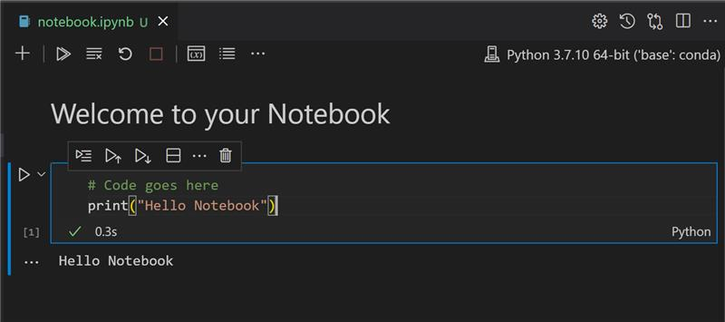
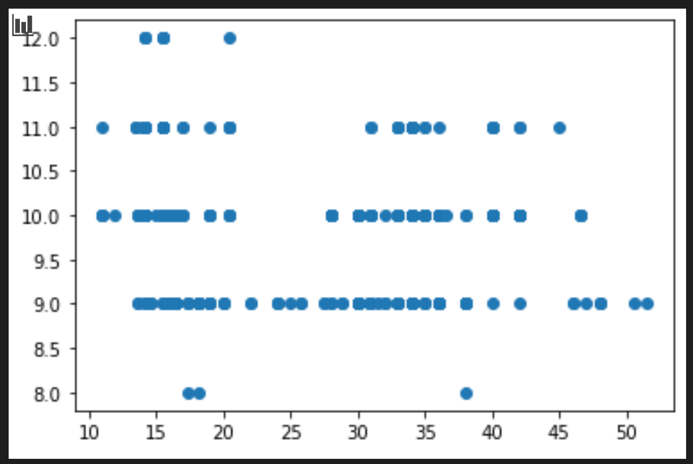
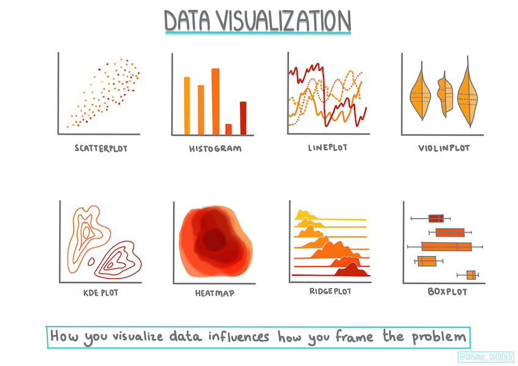
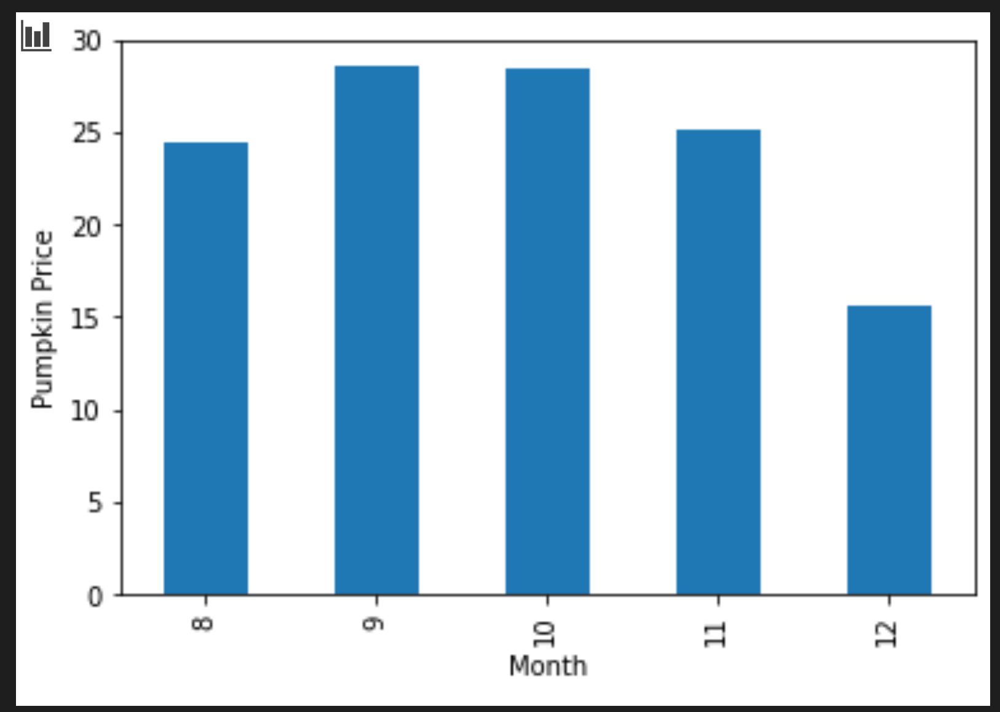

# Regression models for machine learning
## Regional topic: Regression models for pumpkin prices in North America 🎃

In North America, pumpkins are often carved into scary faces for Halloween. Let's discover more about these fascinating vegetables!


> Photo by <a href="https://unsplash.com/@teutschmann?utm_source=unsplash&utm_medium=referral&utm_content=creditCopyText">Beth Teutschmann</a> on <a href="https://unsplash.com/s/photos/jack-o-lanterns?utm_source=unsplash&utm_medium=referral&utm_content=creditCopyText">Unsplash</a>
  
## What you will learn

[](https://youtu.be/5QnJtDad4iQ "Regression Introduction video - Click to Watch!")
> 🎥 Click the image above for a quick introduction video to this lesson

The lessons in this section cover types of regression in the context of machine learning. Regression models can help determine the _relationship_ between variables. This type of model can predict values such as length, temperature, or age, thus uncovering relationships between variables as it analyzes data points.

In this series of lessons, you'll discover the differences between linear and logistic regression, and when you should prefer one over the other.

[](https://youtu.be/XA3OaoW86R8 "ML for beginners - Introduction to Regression models for Machine Learning")

> 🎥 Click the image above for a short video introducing regression models.

In this group of lessons, you will get set up to begin machine learning tasks, including configuring Visual Studio Code to manage notebooks, the common environment for data scientists. You will discover Scikit-learn, a library for machine learning, and you will build your first models, focusing on Regression models in this chapter.

### Lessons

1. **Tools of the trade** – setting up your environment for regression work.
2. **Managing data** – cleaning and visualizing the pumpkin dataset.
3. [Linear and polynomial regression](3-Linear/README.md)
4. [Logistic regression](4-Logistic/README.md)

---

## Lesson 1: Tools of the trade

### Get started with Python and Scikit-learn for regression models


> Sketchnote by [Tomomi Imura](https://www.twitter.com/girlie_mac)


#### Pre-lecture quiz

https://ff-quizzes.netlify.app/en/ml/

> ### This lesson is available in R!
> 
> ./solution/R/lesson_1.html

### Introduction

In these four lessons, you will discover how to build regression models. We will discuss what these are for shortly. But before you do anything, make sure you have the right tools in place to start the process!

In this lesson, you will learn how to:

- Configure your computer for local machine learning tasks.
- Work with Jupyter notebooks.
- Use Scikit-learn, including installation.
- Explore linear regression with a hands-on exercise.

### Your ML authoring environment

You are going to use **notebooks** to develop your Python code and create machine learning models. This type of file is a common tool for data scientists, and they can be identified by their suffix or extension `.ipynb`.

Notebooks are an interactive environment that allow the developer to both code and add notes and write documentation around the code which is quite helpful for experimental or research-oriented projects.

[](https://youtu.be/7E-jC8FLA2E "ML for beginners - Set up Jupyter Notebooks to start building regression models")

> 🎥 Click the image above for a short video working through this exercise.

#### Exercise - work with a notebook

In this folder, you will find the file _notebook.ipynb_.

1. Open _notebook.ipynb_ in Visual Studio Code.

   A Jupyter server will start with Python 3+ started. You will find areas of the notebook that can be `run`, pieces of code. You can run a code block, by selecting the icon that looks like a play button.

1. Select the `md` icon and add a bit of markdown, and the following text **# Welcome to your notebook**.

   Next, add some Python code.

1. Type **print('hello notebook')** in the code block.
1. Select the arrow to run the code.

   You should see the printed statement:

    ```output
    hello notebook
    ```



You can interleaf your code with comments to self-document the notebook.

✅ Think for a minute how different a web developer's working environment is versus that of a data scientist.

### Up and running with Scikit-learn

Now that Python is set up in your local environment, and you are comfortable with Jupyter notebooks, let's get equally comfortable with Scikit-learn (pronounce it `sci` as in `science`). Scikit-learn provides an [extensive API](https://scikit-learn.org/stable/modules/classes.html#api-ref) to help you perform ML tasks.

According to their [website](https://scikit-learn.org/stable/getting_started.html), "Scikit-learn is an open source machine learning library that supports supervised and unsupervised learning. It also provides various tools for model fitting, data preprocessing, model selection and evaluation, and many other utilities."

In this course, you will use Scikit-learn and other tools to build machine learning models to perform what we call 'traditional machine learning' tasks. We have deliberately avoided neural networks and deep learning, as they are better covered in our forthcoming 'AI for Beginners' curriculum.

Scikit-learn makes it straightforward to build models and evaluate them for use. It is primarily focused on using numeric data and contains several ready-made datasets for use as learning tools. It also includes pre-built models for students to try. Let's explore the process of loading prepackaged data and using a built in estimator  first ML model with Scikit-learn with some basic data.

### Exercise - your first Scikit-learn notebook

> This tutorial was inspired by the [linear regression example](https://scikit-learn.org/stable/auto_examples/linear_model/plot_ols.html#sphx-glr-auto-examples-linear-model-plot-ols-py) on Scikit-learn's web site.


[](https://youtu.be/2xkXL5EUpS0 "ML for beginners - Your First Linear Regression Project in Python")

> 🎥 Click the image above for a short video working through this exercise.

In the _notebook.ipynb_ file associated to this lesson, clear out all the cells by pressing the 'trash can' icon.

In this section, you will work with a small dataset about diabetes that is built into Scikit-learn for learning purposes. Imagine that you wanted to test a treatment for diabetic patients. Machine Learning models might help you determine which patients would respond better to the treatment, based on combinations of variables. Even a very basic regression model, when visualized, might show information about variables that would help you organize your theoretical clinical trials.

✅ There are many types of regression methods, and which one you pick depends on the answer you're looking for. If you want to predict the probable height for a person of a given age, you'd use linear regression, as you're seeking a **numeric value**. If you're interested in discovering whether a type of cuisine should be considered vegan or not, you're looking for a **category assignment** so you would use logistic regression. You'll learn more about logistic regression later. Think a bit about some questions you can ask of data, and which of these methods would be more appropriate.

Let's get started on this task.

#### Import libraries

For this task we will import some libraries:

- **matplotlib**. It's a useful [graphing tool](https://matplotlib.org/) and we will use it to create a line plot.
- **numpy**. [numpy](https://numpy.org/doc/stable/user/whatisnumpy.html) is a useful library for handling numeric data in Python.
- **sklearn**. This is the [Scikit-learn](https://scikit-learn.org/stable/user_guide.html) library.

Import some libraries to help with your tasks.

1. Add imports by typing the following code:

   ```python
   import matplotlib.pyplot as plt
   import numpy as np
   from sklearn import datasets, linear_model, model_selection
   ```

   Above you are importing `matplotlib`, `numpy` and you are importing `datasets`, `linear_model` and `model_selection` from `sklearn`. `model_selection` is used for splitting data into training and test sets.

### The diabetes dataset

The built-in [diabetes dataset](https://scikit-learn.org/stable/datasets/toy_dataset.html#diabetes-dataset) includes 442 samples of data around diabetes, with 10 feature variables, some of which include:

- age: age in years
- bmi: body mass index
- bp: average blood pressure
- s1 tc: T-Cells (a type of white blood cells)

✅ This dataset includes the concept of 'sex' as a feature variable important to research around diabetes. Many medical datasets include this type of binary classification. Think a bit about how categorizations such as this might exclude certain parts of a population from treatments.

Now, load up the X and y data.

> 🎓 Remember, this is supervised learning, and we need a named 'y' target.

In a new code cell, load the diabetes dataset by calling `load_diabetes()`. The input `return_X_y=True` signals that `X` will be a data matrix, and `y` will be the regression target.

1. Add some print commands to show the shape of the data matrix and its first element:

    ```python
    X, y = datasets.load_diabetes(return_X_y=True)
    print(X.shape)
    print(X[0])
    ```

    What you are getting back as a response, is a tuple. What you are doing is to assign the two first values of the tuple to `X` and `y` respectively. Learn more [about tuples](https://wikipedia.org/wiki/Tuple).

    You can see that this data has 442 items shaped in arrays of 10 elements:

    ```text
    (442, 10)
    [ 0.03807591  0.05068012  0.06169621  0.02187235 -0.0442235  -0.03482076
    -0.04340085 -0.00259226  0.01990842 -0.01764613]
    ```

    ✅ Think a bit about the relationship between the data and the regression target. Linear regression predicts relationships between feature X and target variable y. Can you find the [target](https://scikit-learn.org/stable/datasets/toy_dataset.html#diabetes-dataset) for the diabetes dataset in the documentation? What is this dataset demonstrating, given that target?

2. Next, select a portion of this dataset to plot by selecting the 3rd column of the dataset. You can do this by using the `:` operator to select all rows, and then selecting the 3rd column using the index (2). You can also reshape the data to be a 2D array - as required for plotting - by using `reshape(n_rows, n_columns)`. If one of the parameter is -1, the corresponding dimension is calculated automatically.

   ```python
   X = X[:, 2]
   X = X.reshape((-1,1))
   ```

   ✅ At any time, print out the data to check its shape.

3. Now that you have data ready to be plotted, you can see if a machine can help determine a logical split between the numbers in this dataset. To do this, you need to split both the data (X) and the target (y) into test and training sets. Scikit-learn has a straightforward way to do this; you can split your test data at a given point.

   ```python
   X_train, X_test, y_train, y_test = model_selection.train_test_split(X, y, test_size=0.33)
   ```

4. Now you are ready to train your model! Load up the linear regression model and train it with your X and y training sets using `model.fit()`:

    ```python
    model = linear_model.LinearRegression()
    model.fit(X_train, y_train)
    ```

    ✅ `model.fit()` is a function you'll see in many ML libraries such as TensorFlow

5. Then, create a prediction using test data, using the function `predict()`. This will be used to draw the line between data groups

    ```python
    y_pred = model.predict(X_test)
    ```

6. Now it's time to show the data in a plot. Matplotlib is a very useful tool for this task. Create a scatterplot of all the X and y test data, and use the prediction to draw a line in the most appropriate place, between the model's data groupings.

    ```python
    plt.scatter(X_test, y_test,  color='black')
    plt.plot(X_test, y_pred, color='blue', linewidth=3)
    plt.xlabel('Scaled BMIs')
    plt.ylabel('Disease Progression')
    plt.title('A Graph Plot Showing Diabetes Progression Against BMI')
    plt.show()
    ```

   

   ✅ Think a bit about what's going on here. A straight line is running through many small dots of data, but what is it doing exactly? Can you see how you should be able to use this line to predict where a new, unseen data point should fit in relationship to the plot's y axis? Try to put into words the practical use of this model.

Congratulations, you built your first linear regression model, created a prediction with it, and displayed it in a plot!

---

## Lesson 2: Managing data

### Build a regression model using Scikit-learn: prepare and visualize data



Infographic by [Dasani Madipalli](https://twitter.com/dasani_decoded)

#### Pre-lecture quiz

https://ff-quizzes.netlify.app/en/ml/

> ### This lesson is available in R!
> 
> ./solution/R/lesson_2.html

### Introduction

Now that you are set up with the tools you need to start tackling machine learning model building with Scikit-learn, you are ready to start asking questions of your data. As you work with data and apply ML solutions, it's very important to understand how to ask the right question to properly unlock the potentials of your dataset.

In this lesson, you will learn:

- How to prepare your data for model-building.
- How to use Matplotlib for data visualization.

### Asking the right question of your data

The question you need answered will determine what type of ML algorithms you will leverage. And the quality of the answer you get back will be heavily dependent on the nature of your data.

Take a look at the [data](https://github.com/microsoft/ML-For-Beginners/blob/main/2-Regression/data/US-pumpkins.csv) provided for this lesson. You can open this .csv file in VS Code. A quick skim immediately shows that there are blanks and a mix of strings and numeric data. There's also a strange column called 'Package' where the data is a mix between 'sacks', 'bins' and other values. The data, in fact, is a bit of a mess.

[](https://youtu.be/5qGjczWTrDQ "ML for beginners - How to Analyze and Clean a Dataset")

> 🎥 Click the image above for a short video working through preparing the data for this lesson.

In fact, it is not very common to be gifted a dataset that is completely ready to use to create a ML model out of the box. In this lesson, you will learn how to prepare a raw dataset using standard Python libraries. You will also learn various techniques to visualize the data.

### Case study: 'the pumpkin market'

In this folder you will find a .csv file in the root `data` folder called [US-pumpkins.csv](https://github.com/microsoft/ML-For-Beginners/blob/main/2-Regression/data/US-pumpkins.csv) which includes 1757 lines of data about the market for pumpkins, sorted into groupings by city. This is raw data extracted from the [Specialty Crops Terminal Markets Standard Reports](https://www.marketnews.usda.gov/mnp/fv-report-config-step1?type=termPrice) distributed by the United States Department of Agriculture.

### Preparing data

This data is in the public domain. It can be downloaded in many separate files, per city, from the USDA web site. To avoid too many separate files, we have concatenated all the city data into one spreadsheet, thus we have already _prepared_ the data a bit. Next, let's take a closer look at the data.

### The pumpkin data - early conclusions

What do you notice about this data? You already saw that there is a mix of strings, numbers, blanks and strange values that you need to make sense of.

What question can you ask of this data, using a Regression technique? What about "Predict the price of a pumpkin for sale during a given month". Looking again at the data, there are some changes you need to make to create the data structure necessary for the task.

### Exercise - analyze the pumpkin data

Let's use [Pandas](https://pandas.pydata.org/), (the name stands for `Python Data Analysis`) a tool very useful for shaping data, to analyze and prepare this pumpkin data.

#### First, check for missing dates

You will first need to take steps to check for missing dates:

1. Convert the dates to a month format (these are US dates, so the format is `MM/DD/YYYY`).
2. Extract the month to a new column.

Open the _notebook.ipynb_ file in Visual Studio Code and import the spreadsheet in to a new Pandas dataframe.

1. Use the `head()` function to view the first five rows.

    ```python
    import pandas as pd
    pumpkins = pd.read_csv('../data/US-pumpkins.csv')
    pumpkins.head()
    ```

    ✅ What function would you use to view the last five rows?

1. Check if there is missing data in the current dataframe:

    ```python
    pumpkins.isnull().sum()
    ```

    There is missing data, but maybe it won't matter for the task at hand.

1. To make your dataframe easier to work with, select only the columns you need, using the `loc` function which extracts from the original dataframe a group of rows (passed as first parameter) and columns (passed as second parameter). The expression `:` in the case below means "all rows".

    ```python
    columns_to_select = ['Package', 'Low Price', 'High Price', 'Date']
    pumpkins = pumpkins.loc[:, columns_to_select]
    ```

### Second, determine average price of pumpkin

Think about how to determine the average price of a pumpkin in a given month. What columns would you pick for this task? Hint: you'll need 3 columns.

Solution: take the average of the `Low Price` and `High Price` columns to populate the new Price column, and convert the Date column to only show the month. Fortunately, according to the check above, there is no missing data for dates or prices.

1. To calculate the average, add the following code:

    ```python
    price = (pumpkins['Low Price'] + pumpkins['High Price']) / 2

    month = pd.DatetimeIndex(pumpkins['Date']).month

    ```

   ✅ Feel free to print any data you'd like to check using `print(month)`.

2. Now, copy your converted data into a fresh Pandas dataframe:

    ```python
    new_pumpkins = pd.DataFrame({'Month': month, 'Package': pumpkins['Package'], 'Low Price': pumpkins['Low Price'],'High Price': pumpkins['High Price'], 'Price': price})
    ```

    Printing out your dataframe will show you a clean, tidy dataset on which you can build your new regression model.

### But wait! There's something odd here

If you look at the `Package` column, pumpkins are sold in many different configurations. Some are sold in '1 1/9 bushel' measures, and some in '1/2 bushel' measures, some per pumpkin, some per pound, and some in big boxes with varying widths.

> Pumpkins seem very hard to weigh consistently

Digging into the original data, it's interesting that anything with `Unit of Sale` equalling 'EACH' or 'PER BIN' also have the `Package` type per inch, per bin, or 'each'. Pumpkins seem to be very hard to weigh consistently, so let's filter them by selecting only pumpkins with the string 'bushel' in their `Package` column.

1. Add a filter at the top of the file, under the initial .csv import:

    ```python
    pumpkins = pumpkins[pumpkins['Package'].str.contains('bushel', case=True, regex=True)]
    ```

    If you print the data now, you can see that you are only getting the 415 or so rows of data containing pumpkins by the bushel.

### But wait! There's one more thing to do

Did you notice that the bushel amount varies per row? You need to normalize the pricing so that you show the pricing per bushel, so do some math to standardize it.

1. Add these lines after the block creating the new_pumpkins dataframe:

    ```python
    new_pumpkins.loc[new_pumpkins['Package'].str.contains('1 1/9'), 'Price'] = price/(1 + 1/9)

    new_pumpkins.loc[new_pumpkins['Package'].str.contains('1/2'), 'Price'] = price/(1/2)
    ```

✅ According to [The Spruce Eats](https://www.thespruceeats.com/how-much-is-a-bushel-1389308), a bushel's weight depends on the type of produce, as it's a volume measurement. "A bushel of tomatoes, for example, is supposed to weigh 56 pounds... Leaves and greens take up more space with less weight, so a bushel of spinach is only 20 pounds." It's all pretty complicated! Let's not bother with making a bushel-to-pound conversion, and instead price by the bushel. All this study of bushels of pumpkins, however, goes to show how very important it is to understand the nature of your data!

Now, you can analyze the pricing per unit based on their bushel measurement. If you print out the data one more time, you can see how it's standardized.

✅ Did you notice that pumpkins sold by the half-bushel are very expensive? Can you figure out why? Hint: little pumpkins are way pricier than big ones, probably because there are so many more of them per bushel, given the unused space taken by one big hollow pie pumpkin.

### Visualization Strategies

Part of the data scientist's role is to demonstrate the quality and nature of the data they are working with. To do this, they often create interesting visualizations, or plots, graphs, and charts, showing different aspects of data. In this way, they are able to visually show relationships and gaps that are otherwise hard to uncover.

[](https://youtu.be/SbUkxH6IJo0 "ML for beginners - How to Visualize Data with Matplotlib")

> 🎥 Click the image above for a short video working through visualizing the data for this lesson.

Visualizations can also help determine the machine learning technique most appropriate for the data. A scatterplot that seems to follow a line, for example, indicates that the data is a good candidate for a linear regression exercise.

One data visualization library that works well in Jupyter notebooks is [Matplotlib](https://matplotlib.org/) (which you also saw in the previous lesson).

> Get more experience with data visualization in [these tutorials](https://docs.microsoft.com/learn/modules/explore-analyze-data-with-python?WT.mc_id=academic-77952-leestott).

### Exercise - experiment with Matplotlib

Try to create some basic plots to display the new dataframe you just created. What would a basic line plot show?

1. Import Matplotlib at the top of the file, under the Pandas import:

    ```python
    import matplotlib.pyplot as plt
    ```

1. Rerun the entire notebook to refresh.
1. At the bottom of the notebook, add a cell to plot the data as a box:

    ```python
    price = new_pumpkins.Price
    month = new_pumpkins.Month
    plt.scatter(price, month)
    plt.show()
    ```

    

    Is this a useful plot? Does anything about it surprise you?

    It's not particularly useful as all it does is display in your data as a spread of points in a given month.

### Make it useful

To get charts to display useful data, you usually need to group the data somehow. Let's try creating a plot where the y axis shows the months and the data demonstrates the distribution of data.

1. Add a cell to create a grouped bar chart:

    ```python
    new_pumpkins.groupby(['Month'])['Price'].mean().plot(kind='bar')
    plt.ylabel("Pumpkin Price")
    ```

    

    This is a more useful data visualization! It seems to indicate that the highest price for pumpkins occurs in September and October. Does that meet your expectation? Why or why not?

---

### Credits

"ML with regression" was written with ♥️ by [Jen Looper](https://twitter.com/jenlooper)

♥️ Quiz contributors include: [Muhammad Sakib Khan Inan](https://twitter.com/Sakibinan) and [Ornella Altunyan](https://twitter.com/ornelladotcom)

The pumpkin dataset is suggested by [this project on Kaggle](https://www.kaggle.com/usda/a-year-of-pumpkin-prices) and its data is sourced from the [Specialty Crops Terminal Markets Standard Reports](https://www.marketnews.usda.gov/mnp/fv-report-config-step1?type=termPrice) distributed by the United States Department of Agriculture. We have added some points around color based on variety to normalize the distribution. This data is in the public domain.
