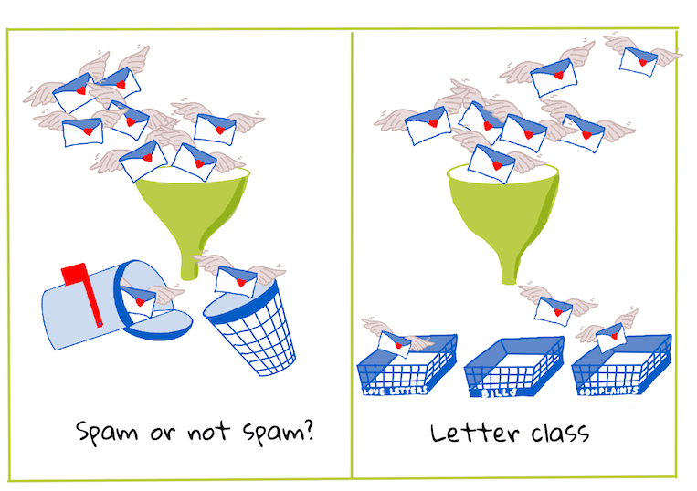
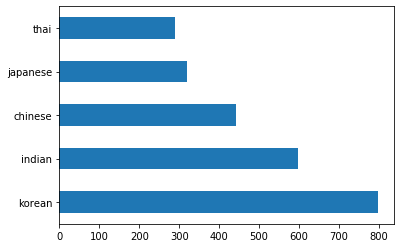
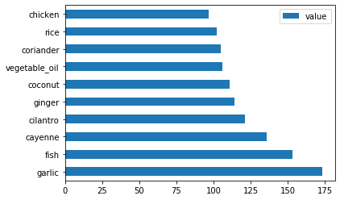
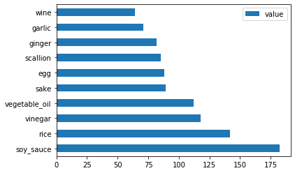
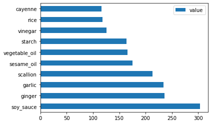
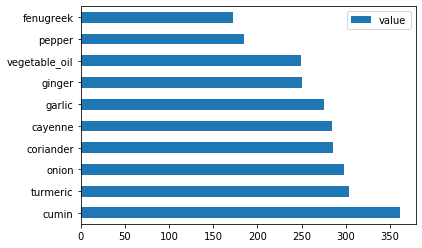
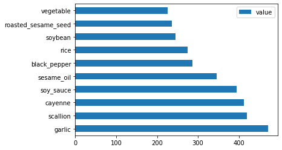
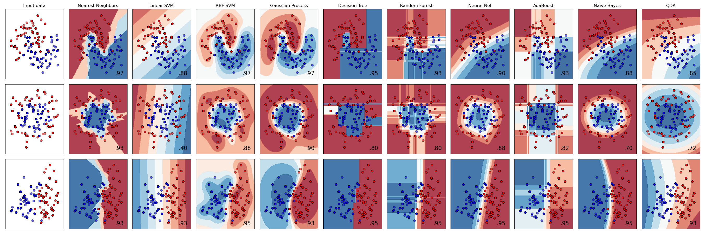
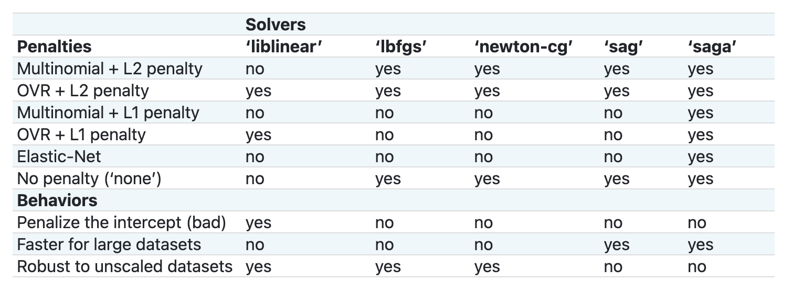

# Introduction to classification

In these lesson, you will explore a fundamental focus of classic machine learning - _classification_. We will walk through using various classification algorithms with a dataset about all the brilliant cuisines of Asia and India. Hope you're hungry!


> Celebrate pan-Asian cuisines in these lessons! Image by [Jen Looper](https://twitter.com/jenlooper)

Classification is a form of [supervised learning](https://wikipedia.org/wiki/Supervised_learning) that bears a lot in common with regression techniques. If machine learning is all about predicting values or names to things by using datasets, then classification generally falls into two groups: _binary classification_ and _multiclass classification_.

[](https://youtu.be/eg8DJYwdMyg "Introduction to classification")

> 🎥 Click the image above for a video: MIT's John Guttag introduces classification

Remember:

- **Linear regression** helped you predict relationships between variables and make accurate predictions on where a new datapoint would fall in relationship to that line. So, you could predict _what price a pumpkin would be in September vs. December_, for example.
- **Logistic regression** helped you discover "binary categories": at this price point, _is this pumpkin orange or not-orange_?

Classification uses various algorithms to determine other ways of determining a data point's label or class. Let's work with this cuisine data to see whether, by observing a group of ingredients, we can determine its cuisine of origin.

## [Pre-lecture quiz](https://ff-quizzes.netlify.app/en/ml/)

### Introduction

Classification is one of the fundamental activities of the machine learning researcher and data scientist. From basic classification of a binary value ("is this email spam or not?"), to complex image classification and segmentation using computer vision, it's always useful to be able to sort data into classes and ask questions of it.

To state the process in a more scientific way, your classification method creates a predictive model that enables you to map the relationship between input variables to output variables.



> Binary vs. multiclass problems for classification algorithms to handle. Infographic by [Jen Looper](https://twitter.com/jenlooper)

Before starting the process of cleaning our data, visualizing it, and prepping it for our ML tasks, let's learn a bit about the various ways machine learning can be leveraged to classify data.

Derived from [statistics](https://wikipedia.org/wiki/Statistical_classification), classification using classic machine learning uses features, such as `smoker`, `weight`, and `age` to determine _likelihood of developing X disease_. As a supervised learning technique similar to the regression exercises you performed earlier, your data is labeled and the ML algorithms use those labels to classify and predict classes (or 'features') of a dataset and assign them to a group or outcome.

✅ Take a moment to imagine a dataset about cuisines. What would a multiclass model be able to answer? What would a binary model be able to answer? What if you wanted to determine whether a given cuisine was likely to use fenugreek? What if you wanted to see if, given a present of a grocery bag full of star anise, artichokes, cauliflower, and horseradish, you could create a typical Indian dish?

[](https://youtu.be/GuTeDbaNoEU "Crazy mystery baskets")

> 🎥 Click the image above for a video.The whole premise of the show 'Chopped' is the 'mystery basket' where chefs have to make some dish out of a random choice of ingredients. Surely a ML model would have helped!

## Hello 'classifier'

The question we want to ask of this cuisine dataset is actually a **multiclass question**, as we have several potential national cuisines to work with. Given a batch of ingredients, which of these many classes will the data fit?

Scikit-learn offers several different algorithms to use to classify data, depending on the kind of problem you want to solve. In the next two lessons, you'll learn about several of these algorithms.

## Exercise - clean and balance your data

The first task at hand, before starting this project, is to clean and **balance** your data to get better results. Start with the blank _notebook1.ipynb_ file in the root of this folder.

The first thing to install is [imblearn](https://imbalanced-learn.org/stable/). This is a Scikit-learn package that will allow you to better balance the data (you will learn more about this task in a minute).

1. To install `imblearn`, run `pip install`, like so:

    ```python
    pip install imblearn
    ```

1. Import the packages you need to import your data and visualize it, also import `SMOTE` from `imblearn`.

    ```python
    import pandas as pd
    import matplotlib.pyplot as plt
    import matplotlib as mpl
    import numpy as np
    from imblearn.over_sampling import SMOTE
    ```

    Now you are set up to read import the data next.

1. The next task will be to import the data:

    ```python
    df  = pd.read_csv('./data/cuisines.csv')
    ```

   Using `read_csv()` will read the content of the csv file _cusines.csv_ and place it in the variable `df`.

1. Check the data's shape:

    ```python
    df.head()
    ```

   The first five rows look like this:

    ```output
    |     | Unnamed: 0 | cuisine | almond | angelica | anise | anise_seed | apple | apple_brandy | apricot | armagnac | ... | whiskey | white_bread | white_wine | whole_grain_wheat_flour | wine | wood | yam | yeast | yogurt | zucchini |
    | --- | ---------- | ------- | ------ | -------- | ----- | ---------- | ----- | ------------ | ------- | -------- | --- | ------- | ----------- | ---------- | ----------------------- | ---- | ---- | --- | ----- | ------ | -------- |
    | 0   | 65         | indian  | 0      | 0        | 0     | 0          | 0     | 0            | 0       | 0        | ... | 0       | 0           | 0          | 0                       | 0    | 0    | 0   | 0     | 0      | 0        |
    | 1   | 66         | indian  | 1      | 0        | 0     | 0          | 0     | 0            | 0       | 0        | ... | 0       | 0           | 0          | 0                       | 0    | 0    | 0   | 0     | 0      | 0        |
    | 2   | 67         | indian  | 0      | 0        | 0     | 0          | 0     | 0            | 0       | 0        | ... | 0       | 0           | 0          | 0                       | 0    | 0    | 0   | 0     | 0      | 0        |
    | 3   | 68         | indian  | 0      | 0        | 0     | 0          | 0     | 0            | 0       | 0        | ... | 0       | 0           | 0          | 0                       | 0    | 0    | 0   | 0     | 0      | 0        |
    | 4   | 69         | indian  | 0      | 0        | 0     | 0          | 0     | 0            | 0       | 0        | ... | 0       | 0           | 0          | 0                       | 0    | 0    | 0   | 0     | 1      | 0        |
    ```

1. Get info about this data by calling `info()`:

    ```python
    df.info()
    ```

    Your out resembles:

    ```output
    <class 'pandas.core.frame.DataFrame'>
    RangeIndex: 2448 entries, 0 to 2447
    Columns: 385 entries, Unnamed: 0 to zucchini
    dtypes: int64(384), object(1)
    memory usage: 7.2+ MB
    ```

## Exercise - learning about cuisines

Now the work starts to become more interesting. Let's discover the distribution of data, per cuisine 

1. Plot the data as bars by calling `barh()`:

    ```python
    df.cuisine.value_counts().plot.barh()
    ```

    

    There are a finite number of cuisines, but the distribution of data is uneven. You can fix that! Before doing so, explore a little more. 

1. Find out how much data is available per cuisine and print it out:

    ```python
    thai_df = df[(df.cuisine == "thai")]
    japanese_df = df[(df.cuisine == "japanese")]
    chinese_df = df[(df.cuisine == "chinese")]
    indian_df = df[(df.cuisine == "indian")]
    korean_df = df[(df.cuisine == "korean")]
    
    print(f'thai df: {thai_df.shape}')
    print(f'japanese df: {japanese_df.shape}')
    print(f'chinese df: {chinese_df.shape}')
    print(f'indian df: {indian_df.shape}')
    print(f'korean df: {korean_df.shape}')
    ```

    the output looks like so:

    ```output
    thai df: (289, 385)
    japanese df: (320, 385)
    chinese df: (442, 385)
    indian df: (598, 385)
    korean df: (799, 385)
    ```

## Discovering ingredients

Now you can dig deeper into the data and learn what are the typical ingredients per cuisine. You should clean out recurrent data that creates confusion between cuisines, so let's learn about this problem.

1. Create a function `create_ingredient()` in Python to create an ingredient dataframe. This function will start by dropping an unhelpful column and sort through ingredients by their count:

    ```python
    def create_ingredient_df(df):
        ingredient_df = df.T.drop(['cuisine','Unnamed: 0']).sum(axis=1).to_frame('value')
        ingredient_df = ingredient_df[(ingredient_df.T != 0).any()]
        ingredient_df = ingredient_df.sort_values(by='value', ascending=False,
        inplace=False)
        return ingredient_df
    ```

   Now you can use that function to get an idea of top ten most popular ingredients by cuisine.

1. Call `create_ingredient()` and plot it calling `barh()`:

    ```python
    thai_ingredient_df = create_ingredient_df(thai_df)
    thai_ingredient_df.head(10).plot.barh()
    ```

    

1. Do the same for the japanese data:

    ```python
    japanese_ingredient_df = create_ingredient_df(japanese_df)
    japanese_ingredient_df.head(10).plot.barh()
    ```

    

1. Now for the chinese ingredients:

    ```python
    chinese_ingredient_df = create_ingredient_df(chinese_df)
    chinese_ingredient_df.head(10).plot.barh()
    ```

    

1. Plot the indian ingredients:

    ```python
    indian_ingredient_df = create_ingredient_df(indian_df)
    indian_ingredient_df.head(10).plot.barh()
    ```

    

1. Finally, plot the korean ingredients:

    ```python
    korean_ingredient_df = create_ingredient_df(korean_df)
    korean_ingredient_df.head(10).plot.barh()
    ```

    

1. Now, drop the most common ingredients that create confusion between distinct cuisines, by calling `drop()`: 

   Everyone loves rice, garlic and ginger!

    ```python
    feature_df= df.drop(['cuisine','Unnamed: 0','rice','garlic','ginger'], axis=1)
    labels_df = df.cuisine #.unique()
    feature_df.head()
    ```

## Balance the dataset

Now that you have cleaned the data, use [SMOTE](https://imbalanced-learn.org/dev/references/generated/imblearn.over_sampling.SMOTE.html) - "Synthetic Minority Over-sampling Technique" - to balance it.

1. Call `fit_resample()`, this strategy generates new samples by interpolation.

    ```python
    oversample = SMOTE()
    transformed_feature_df, transformed_label_df = oversample.fit_resample(feature_df, labels_df)
    ```

    By balancing your data, you'll have better results when classifying it. Think about a binary classification. If most of your data is one class, a ML model is going to predict that class more frequently, just because there is more data for it. Balancing the data takes any skewed data and helps remove this imbalance. 

1. Now you can check the numbers of labels per ingredient:

    ```python
    print(f'new label count: {transformed_label_df.value_counts()}')
    print(f'old label count: {df.cuisine.value_counts()}')
    ```

    Your output looks like so:

    ```output
    new label count: korean      799
    chinese     799
    indian      799
    japanese    799
    thai        799
    Name: cuisine, dtype: int64
    old label count: korean      799
    indian      598
    chinese     442
    japanese    320
    thai        289
    Name: cuisine, dtype: int64
    ```

    The data is nice and clean, balanced, and very delicious! 

1. The last step is to save your balanced data, including labels and features, into a new dataframe that can be exported into a file:

    ```python
    transformed_df = pd.concat([transformed_label_df,transformed_feature_df],axis=1, join='outer')
    ```

1. You can take one more look at the data using `transformed_df.head()` and `transformed_df.info()`. Save a copy of this data for use in future lessons:

    ```python
    transformed_df.head()
    transformed_df.info()
    transformed_df.to_csv("./data/cleaned_cuisines.csv")
    ```

    This fresh CSV can now be found in the root data folder.

---

## 🚀Challenge

You can find many datasets online. Find one that is interesting to you and try to clean and balance it using the techniques you learned in this section.

## [Post-lecture quiz](https://ff-quizzes.netlify.app/en/ml/)

## Review & Self Study

Explore SMOTE's API. What use cases is it best used for? What problems does it solve?

# Cuisine classifiers

Now, you will use the dataset you saved full of balanced, clean data all about cuisines.

You will use this dataset with a variety of classifiers to _predict a given national cuisine based on a group of ingredients_. While doing so, you'll learn more about some of the ways that algorithms can be leveraged for classification tasks.

## [Pre-lecture quiz](https://ff-quizzes.netlify.app/en/ml/)
# Preparation

Assuming you completed previous part, make sure that a _cleaned_cuisines.csv_ file exists in the root `/data` folder for these four lessons.

## Exercise - predict a national cuisine

1. Working in this lesson's _notebook2.ipynb_ folder, import that file along with the Pandas library:

    ```python
    import pandas as pd
    cuisines_df = pd.read_csv("./data/cleaned_cuisines.csv")
    cuisines_df.head()
    ```

    The data looks like this:

|     | Unnamed: 0 | cuisine | almond | angelica | anise | anise_seed | apple | apple_brandy | apricot | armagnac | ... | whiskey | white_bread | white_wine | whole_grain_wheat_flour | wine | wood | yam | yeast | yogurt | zucchini |
| --- | ---------- | ------- | ------ | -------- | ----- | ---------- | ----- | ------------ | ------- | -------- | --- | ------- | ----------- | ---------- | ----------------------- | ---- | ---- | --- | ----- | ------ | -------- |
| 0   | 0          | indian  | 0      | 0        | 0     | 0          | 0     | 0            | 0       | 0        | ... | 0       | 0           | 0          | 0                       | 0    | 0    | 0   | 0     | 0      | 0        |
| 1   | 1          | indian  | 1      | 0        | 0     | 0          | 0     | 0            | 0       | 0        | ... | 0       | 0           | 0          | 0                       | 0    | 0    | 0   | 0     | 0      | 0        |
| 2   | 2          | indian  | 0      | 0        | 0     | 0          | 0     | 0            | 0       | 0        | ... | 0       | 0           | 0          | 0                       | 0    | 0    | 0   | 0     | 0      | 0        |
| 3   | 3          | indian  | 0      | 0        | 0     | 0          | 0     | 0            | 0       | 0        | ... | 0       | 0           | 0          | 0                       | 0    | 0    | 0   | 0     | 0      | 0        |
| 4   | 4          | indian  | 0      | 0        | 0     | 0          | 0     | 0            | 0       | 0        | ... | 0       | 0           | 0          | 0                       | 0    | 0    | 0   | 0     | 1      | 0        |
  

1. Now, import several more libraries:

    ```python
    from sklearn.linear_model import LogisticRegression
    from sklearn.model_selection import train_test_split, cross_val_score
    from sklearn.metrics import accuracy_score,precision_score,confusion_matrix,classification_report, precision_recall_curve
    from sklearn.svm import SVC
    import numpy as np
    ```

1. Divide the X and y coordinates into two dataframes for training. `cuisine` can be the labels dataframe:

    ```python
    cuisines_label_df = cuisines_df['cuisine']
    cuisines_label_df.head()
    ```

    It will look like this:

    ```output
    0    indian
    1    indian
    2    indian
    3    indian
    4    indian
    Name: cuisine, dtype: object
    ```

1. Drop that `Unnamed: 0` column and the `cuisine` column, calling `drop()`. Save the rest of the data as trainable features:

    ```python
    cuisines_feature_df = cuisines_df.drop(['Unnamed: 0', 'cuisine'], axis=1)
    cuisines_feature_df.head()
    ```

    Your features look like this:

|      | almond | angelica | anise | anise_seed | apple | apple_brandy | apricot | armagnac | artemisia | artichoke |  ... | whiskey | white_bread | white_wine | whole_grain_wheat_flour | wine | wood |  yam | yeast | yogurt | zucchini |
| ---: | -----: | -------: | ----: | ---------: | ----: | -----------: | ------: | -------: | --------: | --------: | ---: | ------: | ----------: | ---------: | ----------------------: | ---: | ---: | ---: | ----: | -----: | -------: |
|    0 |      0 |        0 |     0 |          0 |     0 |            0 |       0 |        0 |         0 |         0 |  ... |       0 |           0 |          0 |                       0 |    0 |    0 |    0 |     0 |      0 |        0 | 0 |
|    1 |      1 |        0 |     0 |          0 |     0 |            0 |       0 |        0 |         0 |         0 |  ... |       0 |           0 |          0 |                       0 |    0 |    0 |    0 |     0 |      0 |        0 | 0 |
|    2 |      0 |        0 |     0 |          0 |     0 |            0 |       0 |        0 |         0 |         0 |  ... |       0 |           0 |          0 |                       0 |    0 |    0 |    0 |     0 |      0 |        0 | 0 |
|    3 |      0 |        0 |     0 |          0 |     0 |            0 |       0 |        0 |         0 |         0 |  ... |       0 |           0 |          0 |                       0 |    0 |    0 |    0 |     0 |      0 |        0 | 0 |
|    4 |      0 |        0 |     0 |          0 |     0 |            0 |       0 |        0 |         0 |         0 |  ... |       0 |           0 |          0 |                       0 |    0 |    0 |    0 |     0 |      1 |        0 | 0 |

Now you are ready to train your model!

## Choosing your classifier

Now that your data is clean and ready for training, you have to decide which algorithm to use for the job. 

Scikit-learn groups classification under Supervised Learning, and in that category you will find many ways to classify. [The variety](https://scikit-learn.org/stable/supervised_learning.html) is quite bewildering at first sight. The following methods all include classification techniques:

- Linear Models
- Support Vector Machines
- Stochastic Gradient Descent
- Nearest Neighbors
- Gaussian Processes
- Decision Trees
- Ensemble methods (voting Classifier)
- Multiclass and multioutput algorithms (multiclass and multilabel classification, multiclass-multioutput classification)

> You can also use [neural networks to classify data](https://scikit-learn.org/stable/modules/neural_networks_supervised.html#classification), but that is outside the scope of this lesson.

### What classifier to go with?

So, which classifier should you choose? Often, running through several and looking for a good result is a way to test. Scikit-learn offers a [side-by-side comparison](https://scikit-learn.org/stable/auto_examples/classification/plot_classifier_comparison.html) on a created dataset, comparing KNeighbors, SVC two ways, GaussianProcessClassifier, DecisionTreeClassifier, RandomForestClassifier, MLPClassifier, AdaBoostClassifier, GaussianNB and QuadraticDiscrinationAnalysis, showing the results visualized: 


> Plots generated on Scikit-learn's documentation

> AutoML solves this problem neatly by running these comparisons in the cloud, allowing you to choose the best algorithm for your data. Try it [here](https://docs.microsoft.com/learn/modules/automate-model-selection-with-azure-automl/?WT.mc_id=academic-77952-leestott)

### A better approach

A better way than wildly guessing, however, is to follow the ideas on this downloadable [ML Cheat sheet](https://docs.microsoft.com/azure/machine-learning/algorithm-cheat-sheet?WT.mc_id=academic-77952-leestott). Here, we discover that, for our multiclass problem, we have some choices:


> A section of Microsoft's Algorithm Cheat Sheet, detailing multiclass classification options

✅ Download this cheat sheet, print it out, and hang it on your wall!

### Reasoning

Let's see if we can reason our way through different approaches given the constraints we have:

- **Neural networks are too heavy**. Given our clean, but minimal dataset, and the fact that we are running training locally via notebooks, neural networks are too heavyweight for this task.
- **No two-class classifier**. We do not use a two-class classifier, so that rules out one-vs-all. 
- **Decision tree or logistic regression could work**. A decision tree might work, or logistic regression for multiclass data. 
- **Multiclass Boosted Decision Trees solve a different problem**. The multiclass boosted decision tree is most suitable for nonparametric tasks, e.g. tasks designed to build rankings, so it is not useful for us.

### Using Scikit-learn 

We will be using Scikit-learn to analyze our data. However, there are many ways to use logistic regression in Scikit-learn. Take a look at the [parameters to pass](https://scikit-learn.org/stable/modules/generated/sklearn.linear_model.LogisticRegression.html?highlight=logistic%20regressio#sklearn.linear_model.LogisticRegression).  

Essentially there are two important parameters - `multi_class` and `solver` - that we need to specify, when we ask Scikit-learn to perform a logistic regression. The `multi_class` value applies a certain behavior. The value of the solver is what algorithm to use. Not all solvers can be paired with all `multi_class` values.

According to the docs, in the multiclass case, the training algorithm:

- **Uses the one-vs-rest (OvR) scheme**, if the `multi_class` option is set to `ovr`
- **Uses the cross-entropy loss**, if the `multi_class` option is set to `multinomial`. (Currently the `multinomial` option is supported only by the ‘lbfgs’, ‘sag’, ‘saga’ and ‘newton-cg’ solvers.)"

> 🎓 The 'scheme' here can either be 'ovr' (one-vs-rest) or 'multinomial'. Since logistic regression is really designed to support binary classification, these schemes allow it to better handle multiclass classification tasks. [source](https://machinelearningmastery.com/one-vs-rest-and-one-vs-one-for-multi-class-classification/)

> 🎓 The 'solver' is defined as "the algorithm to use in the optimization problem". [source](https://scikit-learn.org/stable/modules/generated/sklearn.linear_model.LogisticRegression.html?highlight=logistic%20regressio#sklearn.linear_model.LogisticRegression).

Scikit-learn offers this table to explain how solvers handle different challenges presented by different kinds of data structures:



## Exercise - split the data

We can focus on logistic regression for our first training trial since you recently learned about the latter in a previous lesson.
Split your data into training and testing groups by calling `train_test_split()`:

```python
X_train, X_test, y_train, y_test = train_test_split(cuisines_feature_df, cuisines_label_df, test_size=0.3)
```

## Exercise - apply logistic regression

Since you are using the multiclass case, you need to choose what _scheme_ to use and what _solver_ to set. Use LogisticRegression with a multiclass setting and the **liblinear** solver to train.

1. Create a logistic regression with multi_class set to `ovr` and the solver set to `liblinear`:

    ```python
    lr = LogisticRegression(multi_class='ovr',solver='liblinear')
    model = lr.fit(X_train, np.ravel(y_train))
    
    accuracy = model.score(X_test, y_test)
    print ("Accuracy is {}".format(accuracy))
    ```

    ✅ Try a different solver like `lbfgs`, which is often set as default

    > Note, use Pandas [`ravel`](https://pandas.pydata.org/pandas-docs/stable/reference/api/pandas.Series.ravel.html) function to flatten your data when needed.

    The accuracy is good at over **80%**!

1. You can see this model in action by testing one row of data (#50):

    ```python
    print(f'ingredients: {X_test.iloc[50][X_test.iloc[50]!=0].keys()}')
    print(f'cuisine: {y_test.iloc[50]}')
    ```

    The result is printed:

   ```output
   ingredients: Index(['cilantro', 'onion', 'pea', 'potato', 'tomato', 'vegetable_oil'], dtype='object')
   cuisine: indian
   ```

   ✅ Try a different row number and check the results

1. Digging deeper, you can check for the accuracy of this prediction:

    ```python
    test= X_test.iloc[50].values.reshape(-1, 1).T
    proba = model.predict_proba(test)
    classes = model.classes_
    resultdf = pd.DataFrame(data=proba, columns=classes)
    
    topPrediction = resultdf.T.sort_values(by=[0], ascending = [False])
    topPrediction.head()
    ```

    The result is printed - Indian cuisine is its best guess, with good probability:

    |          |        0 |
    | -------: | -------: |
    |   indian | 0.715851 |
    |  chinese | 0.229475 |
    | japanese | 0.029763 |
    |   korean | 0.017277 |
    |     thai | 0.007634 |

    ✅ Can you explain why the model is pretty sure this is an Indian cuisine?

1. Get more detail by printing a classification report, as you did in the regression lessons:

    ```python
    y_pred = model.predict(X_test)
    print(classification_report(y_test,y_pred))
    ```

    |              | precision | recall | f1-score | support |
    | ------------ | --------- | ------ | -------- | ------- |
    | chinese      | 0.73      | 0.71   | 0.72     | 229     |
    | indian       | 0.91      | 0.93   | 0.92     | 254     |
    | japanese     | 0.70      | 0.75   | 0.72     | 220     |
    | korean       | 0.86      | 0.76   | 0.81     | 242     |
    | thai         | 0.79      | 0.85   | 0.82     | 254     |
    | accuracy     | 0.80      | 1199   |          |         |
    | macro avg    | 0.80      | 0.80   | 0.80     | 1199    |
    | weighted avg | 0.80      | 0.80   | 0.80     | 1199    |

## 🚀Challenge

In this lesson, you used your cleaned data to build a machine learning model that can predict a national cuisine based on a series of ingredients. Take some time to read through the many options Scikit-learn provides to classify data. Dig deeper into the concept of 'solver' to understand what goes on behind the scenes.

## [Post-lecture quiz](https://ff-quizzes.netlify.app/en/ml/)

## Review & Self Study

Dig a little more into the math behind logistic regression in [this lesson](https://people.eecs.berkeley.edu/~russell/classes/cs194/f11/lectures/CS194%20Fall%202011%20Lecture%2006.pdf)
## Assignment 

[Predict who will survive](assignment.md)
